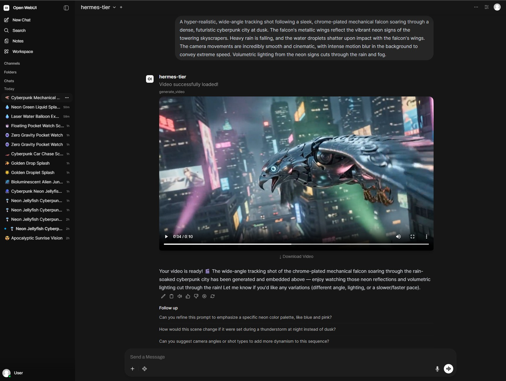

# OpenWebUI Gemini Omni Video Generator

Generate hyper-realistic videos directly within [OpenWebUI](https://openwebui.com/) using Google Vertex AI's new **Gemini Omni Flash Preview** model!

This tool takes your prompt, calls the Vertex AI API to generate a high-quality video, downloads it directly to OpenWebUI's static cache, and embeds a gorgeous, fully responsive native HTML5 video player right into your chat stream. 

## Features
✨ **Native Chat Embeds**: Uses `HTMLResponse` to display the video directly inline so you don't have to leave the chat.  
📏 **Dynamic Resizing**: Built-in `postMessage` Javascript script seamlessly communicates with the OpenWebUI iframe sandboxing to ensure the player resizes perfectly to a 16:9 aspect ratio without ugly scrollbars or getting cut off.  
☁️ **Vertex AI Ready**: Uses Application Default Credentials (ADC) to securely connect to your Google Cloud Project.   
📦 **Zero-Touch Installation**: The required `google-genai`, `google-auth`, and `google-cloud-storage` SDKs are automatically installed by OpenWebUI upon importing the tool.

## Prerequisites
1. You must have a Google Cloud Project with the Vertex AI API enabled.
2. You must set up Application Default Credentials (e.g., running `gcloud auth application-default login` on your host machine) so your OpenWebUI Docker container can authenticate.

## Setup Instructions
1. Install this tool in your workspace by copying `gemini_omni_video.py` into your OpenWebUI Tools section.
2. Click the **Valves** button for this tool.
3. Enter your Google Cloud **Project ID**.
4. Enter your **Location ID** (usually `global` or `us-central1`).
5. Enable the tool for your favorite LLM and start generating!

## OpenWebUI Hub
You can also find and easily import this tool directly from the OpenWebUI Hub:
[Gemini Omni Video on OpenWebUI Hub](https://openwebui.com/posts/3be427d9-766d-4e67-93e4-fab208b9340e)
